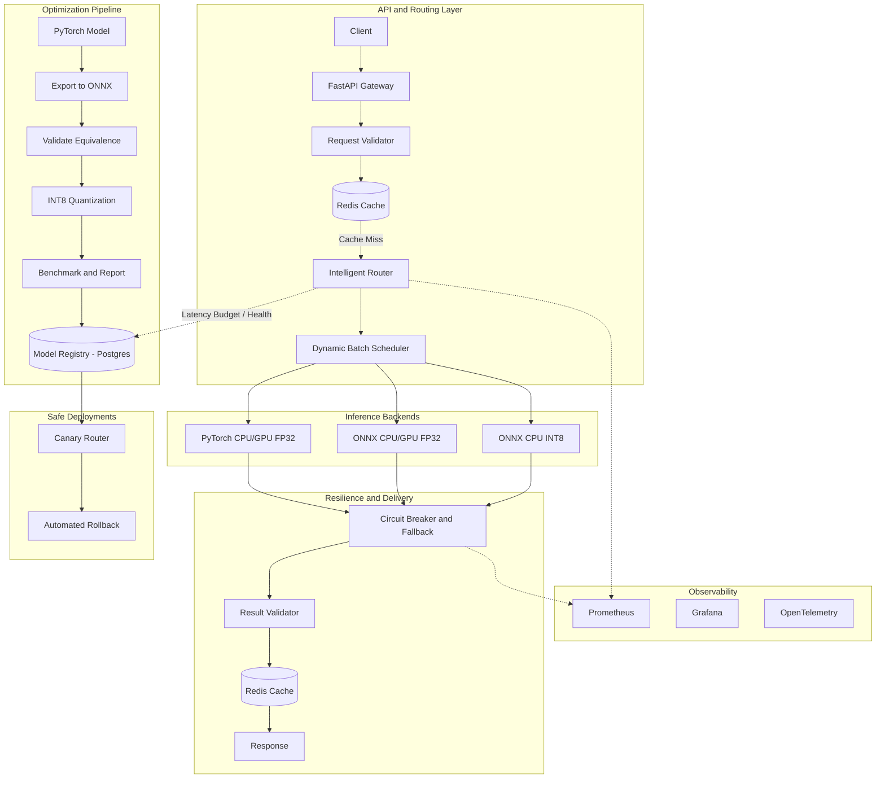

# InferX — Production AI Inference & Optimization Platform

InferX is a comprehensive, production-grade AI inference platform designed for serving multiple versions of machine learning models with dynamic, intelligent request routing. Built for high performance and resilience, InferX acts as an advanced API Gateway and model serving layer capable of dynamically balancing strict latency budgets against model accuracy and hardware constraints.

## Table of Contents
1. [Project Status](#project-status)
2. [Core Features](#core-features)
3. [Architecture Overview](#architecture-overview)
4. [Intelligent Model Routing](#intelligent-model-routing)
5. [Performance & Optimization](#performance--optimization)
6. [Resilience & Deployment](#resilience--deployment)
7. [Observability](#observability)
8. [Quick Start & CLI](#quick-start--cli)

---

## Project Status

| Feature | Status | Notes |
|---------|--------|-------|
| **Multi-Runtime Support** | ✅ Implemented | PyTorch and ONNX bindings fully integrated. |
| **Dynamic Request Routing** | ✅ Implemented | Weighted scoring maps budget, latency, and health logic. |
| **Dynamic Batching** | ✅ Implemented | End-to-end integration blocking native limits properly via Queue. |
| **Cache (Redis)** | ✅ Implemented | Central async caching layer connected and mapped. |
| **Tracing (OpenTelemetry)** | ✅ Implemented | Instrumented via OTLP FastAPI mounts directly in lifespan. |
| **Chaos Testing** | ✅ Implemented | Full cli suite implemented under `inferx chaos run`. |
| **Automatic Rollbacks** | ✅ Implemented | `RollbackEvaluator` background thread fully active. |

---

## Core Features

- **Multi-Runtime Support:** Seamlessly execute models across **PyTorch** and **ONNX Runtime**, automatically detecting and leveraging CPU or GPU hardware.
- **Precision Agnostic:** Full support for FP32, FP16, and INT8 quantized models.
- **Dynamic Request Routing:** Automatically routes incoming requests to the optimal model version based on configurable latency budgets, system load, and real-time model health.
- **Dynamic Batching:** Automatically groups concurrent requests into execution batches to maximize throughput.
- **Automated Deployments:** Built-in canary traffic splitting and automatic rollbacks if error rates or latency SLOs are breached.
- **Deep Observability:** Granular profiling, live Prometheus metrics, and OpenTelemetry distributed tracing integrated globally.
- **Chaos Engineering:** In-built chaos testing framework (`inferx chaos`) to validate circuit breakers and system resilience under degraded conditions.

---

## Architecture Overview

InferX is more than just a wrapper; it's a complete ecosystem covering model optimization, intelligent routing, execution, and observability. The diagram below illustrates the end-to-end lifecycle of a model and a request within the platform.



### Component Responsibilities
- **API Gateway (FastAPI):** Handles HTTP connections, validates input payloads, and coordinates the asynchronous request lifecycle.
- **Intelligent Model Router:** Evaluates candidate models against real-time latency budgets, health scores, and accuracy requirements to select the best backend for every single request.
- **Batch Scheduler:** Queues and assembles concurrent requests into optimal batch sizes without exceeding the maximum wait time threshold (`max_wait_ms`).
- **Model Registry:** A PostgreSQL-backed persistent storage layer tracking model metadata, active versions, calibration metrics, and health states.
- **Resilience Layer:** Contains Circuit Breakers to prevent cascading failures, exponential backoff retries, and fallback execution pathways.

---

## Intelligent Model Routing

The core of InferX is its routing logic. Clients do not hardcode which specific backend they want; instead, they declare their requirements:

```json
POST /v1/inference
{
  "model": "mobilenet_v3_small",
  "latency_budget_ms": 20,
  "accuracy_priority": "balanced"
}
```

The router calculates a combined score for every active candidate model based on:
1. **Latency Budget:** Models whose P95 latency exceeds the budget are penalized or discarded.
2. **Model Health:** The system continuously monitors P95 latencies and error rates. If a model degrades, its health score plummets.
3. **Accuracy & Tier:** Weighted scores are applied depending on whether the client prioritized accuracy or speed.

If the budget is `< 10ms`, the router will dynamically select the **ONNX INT8 CPU** model. If the budget is generous (`> 50ms`), it may route to a heavier **PyTorch FP32** model.

---

## Performance & Optimization

InferX includes a full suite of model optimization pipelines designed to measure and improve raw execution speed.

### Model Export & Quantization Pipeline
The repository includes dedicated scripts to take a base PyTorch model and optimize it:
1. **Export:** Converts PyTorch to ONNX format.
2. **Validation:** Asserts numerical equivalence (mean absolute difference) between PyTorch and ONNX outputs to ensure conversion integrity.
3. **Quantization:** Applies dynamic INT8 quantization to the ONNX graph.
4. **Benchmarking:** Automatically measures FP32 vs INT8 P50/P95 latencies, throughput, and memory footprint.

### C++ Preprocessing
To eliminate Python overhead in the critical path, image resizing and tensor normalization are implemented natively in C++ using `pybind11` as the `inferx_preprocess` library module.

### Dynamic Batching
Inference execution is highly parallelizable. The `BatchScheduler` intercepts incoming requests, pauses them for up to `max_wait_ms`, concatenates them into a single tensor, and dispatches the batch to the hardware, dramatically increasing total system throughput at the cost of a few milliseconds of baseline latency.

---

## Resilience & Deployment

Production systems must anticipate failure. InferX implements several reliability patterns:

- **Circuit Breakers:** If a backend fails repeatedly, the circuit breaker opens, immediately rejecting requests to that backend to prevent resource exhaustion. It enters a `HALF_OPEN` state after a timeout to probe for recovery.
- **Fallback Execution:** If the primary model selection fails, the system automatically attempts execution against a lower-tier fallback model.
- **Canary Routing:** Supports deploying a new model version (e.g., `v2-canary`) and routing a configurable percentage of traffic (e.g., 5%) to it.
- **Automatic Rollback:** The `RollbackEvaluator` continuously compares the canary's P95 latency and error rate against the stable version. If thresholds are breached, the canary is automatically marked as `FAILED` and traffic reverts to stable.

---

## Observability

InferX exposes deep insights into the inference lifecycle. 

- **Prometheus Metrics:** Tracks `inference_requests_total`, `inference_latency_seconds`, `queue_depth`, `cache_hits`, and `model_health`.
- **Latency Profiling:** Every request is decomposed into discrete timing segments (Queue Time, Batch Formation Time, Inference Execution Time, Postprocessing Time).
- **Chaos Testing:** Includes an injection framework (`inferx chaos run`) to intentionally degrade backends and validate that observability alerts and circuit breakers trigger correctly.

---

## Quick Start & CLI

InferX provides a rich Command Line Interface for managing the platform.

### Installation
Ensure you have Docker and Docker Compose installed.

```bash
# Clone the repository
git clone https://github.com/RishiSaawarn/inferX---Inference-and-Optimization-Platform.git
cd inferX---Inference-and-Optimization-Platform

# Start the full orchestration suite natively
docker compose up -d --build
```

### Using the CLI
If you want to run the CLI locally on your host machine:

```bash
# Install the CLI tool
pip install -e .[dev]

# List active models
inferx models list

# Run a heavy concurrent load test to benchmark P95 latencies
inferx benchmark run

# Inject artificial latency to test Circuit Breakers
inferx chaos run
```

### Accessing the Dashboards
- **FastAPI Docs:** `http://localhost:8000/docs`
- **Grafana:** `http://localhost:3000`
- **Prometheus:** `http://localhost:9090`
